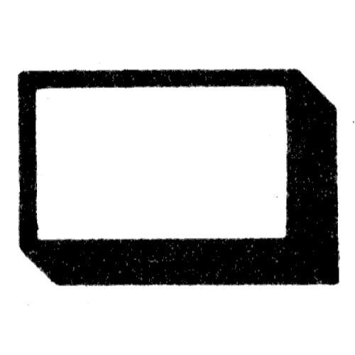

# Catalogue

## Matière
|  | Description |
|--:|---|
| 4-8 | Acier résistance à la rupture 40 à 60 h bar |
| 6-8 | Acier résistance à la rupture 60 à 80 h bar |
| 8-8 | Acier résistance à la rupture 80 à 100 h bar |
| 10-9 | Acier résistance à la rupture 100 à 120 h bar |
| 12-9 | Acier résistance à la rupture 120 à 140 h bar |
| 05 | Acier inoxydable (pour vis et érous) Acier à ressort (pour les rondelles) |
| 2 | Laiton |
| 5 | Acier inoxydable |
| 6 | Aluminium |

## Protection
|  | Description |
|--:|---|
| 02 | Zinguage - Bichromage ou phosphatation |
| 03 | Chromage brillant |
| 04 | Chromage noir |

## Repère couleur
|  Code |   |  Description |
|--:| :-: | --- |
| 1 | <svg width="20" height="20"><circle stroke="black" stroke-width="1" cx="10" cy="10" r="9.5" fill="#fffafa" /></svg> | Chrome |
| 2 | <svg width="20" height="20"><circle stroke="black" stroke-width="1" cx="10" cy="10" r="9.5" fill="#ffd700" /></svg> | Or |
| 3 | <svg width="20" height="20"><circle stroke="black" stroke-width="1" cx="10" cy="10" r="9.5" fill="#ffffff" /></svg> | Blanc |
| 4 | <svg width="20" height="20"><circle stroke="black" stroke-width="1" cx="10" cy="10" r="9.5" fill="#808080" /></svg> | Gris moyen |
| 5 | <svg width="20" height="20"><circle stroke="black" stroke-width="1" cx="10" cy="10" r="9.5" fill="#000000" /></svg> | Noir |
| 6 | <svg width="20" height="20"><circle stroke="black" stroke-width="1" cx="10" cy="10" r="9.5" fill="#0000cd" /></svg> | Bleu moyen |
| 7 | <svg width="20" height="20"><circle stroke="black" stroke-width="1" cx="10" cy="10" r="9.5" fill="#add8e6" /></svg> | Bleu clair |
| 8 | <svg width="20" height="20"><circle stroke="black" stroke-width="1" cx="10" cy="10" r="9.5" fill="#008000" /></svg> | Vert moyen |
| 9 | <svg width="20" height="20"><circle stroke="black" stroke-width="1" cx="10" cy="10" r="9.5" fill="#90ee90" /></svg> | Vert clair |
| 10 | <svg width="20" height="20"><circle stroke="black" stroke-width="1" cx="10" cy="10" r="9.5" fill="#556b2f" /></svg> | Vert olive |
| 11 | <svg width="20" height="20"><circle stroke="black" stroke-width="1" cx="10" cy="10" r="9.5" fill="#ffff00" /></svg> | Jaune |
| 12 | <svg width="20" height="20"><circle stroke="black" stroke-width="1" cx="10" cy="10" r="9.5" fill="#ffa500" /></svg> | Orange |
| 13 | <svg width="20" height="20"><circle stroke="black" stroke-width="1" cx="10" cy="10" r="9.5" fill="#996515" /></svg> | Marron foncé |
| 14 | <svg width="20" height="20"><circle stroke="black" stroke-width="1" cx="10" cy="10" r="9.5" fill="#b5651d" /></svg> | Marron clair |
| 15 | <svg width="20" height="20"><circle stroke="black" stroke-width="1" cx="10" cy="10" r="9.5" fill="ffe4c4" /></svg> | Beige moyen |
| 16 | <svg width="20" height="20"><circle stroke="black" stroke-width="1" cx="10" cy="10" r="9.5" fill="#e03c31" /></svg> | Rouge moyen |
| 17 | <svg width="20" height="20"><circle stroke="black" stroke-width="1" cx="10" cy="10" r="9.5" fill="#fb607f" /></svg> | Rose |
| 18 | <svg width="20" height="20"><circle stroke="black" stroke-width="1" cx="10" cy="10" r="9.5" fill="#bd33a4" /></svg> | Violet |
| 19 | <svg width="20" height="20"><circle stroke="black" stroke-width="1" cx="10" cy="10" r="9.5" fill="#702963" /></svg> | Mauve |
| 20 | <svg width="20" height="20"><circle stroke="black" stroke-width="1" cx="10" cy="10" r="9.5" fill="#a40000" /></svg> | Rouge foncé |
| 21 | <svg width="20" height="20"><circle stroke="black" stroke-width="1" cx="10" cy="10" r="9.5" fill="#d3d3d3" /></svg> | Gris clair |
| 22 | <svg width="20" height="20"><circle stroke="black" stroke-width="1" cx="10" cy="10" r="9.5" fill="#696969" /></svg> | Gris Foncé |
| 23 | <svg width="20" height="20"><circle stroke="black" stroke-width="1" cx="10" cy="10" r="9.5" fill="#ffebcd" /></svg> | Beige clair |
| 24 | <svg width="20" height="20"><circle stroke="black" stroke-width="1" cx="10" cy="10" r="9.5" fill="#deb887" /></svg> | Beige foncé |
| 25 | <svg width="20" height="20"><circle stroke="black" stroke-width="1" cx="10" cy="10" r="9.5" fill="#c19a6b" /></svg> | Marron moyen |

