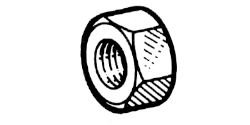

# 77 01 405 674

### Écrou hexagonal M7 {: style="height:75px;min-width:150px;margin-top:-1.25em;float: right;"}

Sac de 30
|   |   |
|---:|---|
**Diamètre** | M7
**Pas** |100
**Hauteur** |5.5 mm
**Matière** | 8-8 Acier résistance à la rupture 80 à 100 h bar
**Protection** | 02 Zinguage - Bichromage ou phosphatation

Mots clés: `7701405674`, `77 01 405 674`
