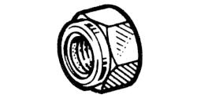

# 77 01 422 002

### Écrou frein hexagonal M10 {: style="height:75px;min-width:150px;margin-top:-1.25em;float: right;"}

Sac de 10
|   |   |
|---:|---|
**Diamètre** | M10
**Pas** |125
**Hauteur** |12.6 mm
**Matière** | 8-8 Acier résistance à la rupture 80 à 100 h bar
**Protection** | 02 Zinguage - Bichromage ou phosphatation

Mots clés: `7701422002`, `77 01 422 002`
