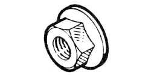

# 77 01 422 009

### Écrou collerette hexagonal M5 {: style="height:75px;min-width:150px;margin-top:-1.25em;float: right;"}

Sac de 30
|   |   |
|---:|---|
**Diamètre** | M5
**Pas** |80
**Hauteur** |5 mm
**Dc** |11.8 mm
**Matière** | 8-8 Acier résistance à la rupture 80 à 100 h bar

Mots clés: `7701422009`, `77 01 422 009`
