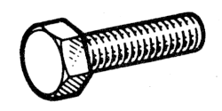

# 77 03 001 373

### Hex Screw M8 {: style="height:75px;min-width:150px;margin-top:-1.25em;float: right;"}

|   |   |
|---:|---|
**Diameter** | M8
**Pitch** |125
**Length** |30 mm
**Material** | 10-9 Steel - tensile strength 100 to 120 h bar
**Protective coating** | 02 Zinc plating - Bichromate or phosphate dipping

Keywords `7703001373`, `77 03 001 373`
