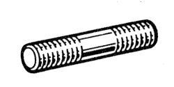

# 77 03 027 037

### Goujon M10 {: style="height:75px;min-width:150px;margin-top:-1.25em;float: right;"}

|   |   |
|---:|---|
**Diamètre** | M10
**Pas** | 150
 | 60 mm
 | 40 mm
 | 20 mm
 | 26 mm
**Matière** | 6-8 Acier résistance à la rupture 60 à 80 h bar

Mots clés: `7703027037`, `77 03 027 037`
