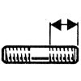

# 77 03 027 102

### Stud M8 {: style="height:75px;min-width:150px;margin-top:-1.25em;float: right;"}

|   |   |
|---:|---|
**Diameter** | M8
**Pitch** | 125
 | 47 mm
 | 25 mm
 | 22 mm
 | 22 mm
**Material** | 6-8 Steel - tensile strength 60 to 80 h bar

Keywords `7703027102`, `77 03 027 102`
