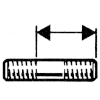

# 77 03 027 223

### Goujon M10 {: style="height:75px;min-width:150px;margin-top:-1.25em;float: right;"}

|   |   |
|---:|---|
**Diamètre** | M10
**Pas** | 125
 | 40 mm
 | 25 mm
 | 15 mm
 | 20 mm
**Matière** | 8-8 Acier résistance à la rupture 80 à 100 h bar

Mots clés: `7703027223`, `77 03 027 223`
