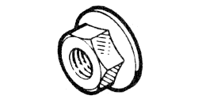

# 77 03 033 025

### Hex collar nut M8 {: style="height:75px;min-width:150px;margin-top:-1.25em;float: right;"}

|   |   |
|---:|---|
**Diameter** | M8
**Pitch** |125
**Height** |8 mm
**Dc** |17.9 mm
**Material** | 8-8 Steel - tensile strength 80 to 100 h bar

Keywords `7703033025`, `77 03 033 025`
