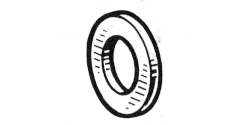

# 77 03 053 345

### Washer M12 {: style="height:75px;min-width:150px;margin-top:-1.25em;float: right;"}

|   |   |
|---:|---|
**Diameter** | M12
**Height** |34 mm
**Thickness** |5 mm
**Material** | 10-9 Steel - tensile strength 100 to 120 h bar

Keywords `7703053345`, `77 03 053 345`
