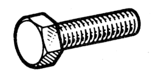

# 77 03 101 090

### Vis hexagonal M10 {: style="height:75px;min-width:150px;margin-top:-1.25em;float: right;"}

|   |   |
|---:|---|
**Diamètre** | M10
**Pas** |125
**Longueur** |110 mm
**Matière** | 10-9 Acier résistance à la rupture 100 à 120 h bar
**Protection** | 02 Zinguage - Bichromage ou phosphatation

Mots clés: `7703101090`, `77 03 101 090`
