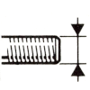
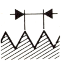
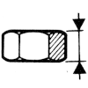
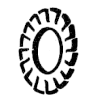

---
search:
  exclude: true
---

# catalog_page_title



## {{ locales.sections.time_frame[LC] }}

### {{ locales.parts_categories.hex_screws[LC] }} ({{ parts_hex_screws.keys() | length }})

|  |  |  |  |  |  |  |
| :--: | :--: | :--: | :--: | :--: | :--: | --: |


{{ desc.nominal_diameter }} | {{ desc.pitch }} | {{ desc.length }} | {{desc.material}} | {{desc.protection}} | {{ desc.quantity if desc.quantity != '1' else ' ' }} | [{{ code }}]({{ item }}) 


### {{ locales.parts_categories.hex_bolts[LC] }} ({{ parts_hex_bolts.keys() | length }})

|  |  |  |  |  |  |  |
| :--: | :--: | :--: | :--: | :--: | :--: | --: |


{{ desc.diameter }} | {{ desc.pitch }} | {{ desc.height }} | {{desc.material}} | {{desc.protection}} | {{ desc.quantity if desc.quantity != '1' else ' ' }} | [{{ code }}]({{ item }}) 


### {{ locales.parts_categories.hex_brake_bolts[LC] }} ({{ parts_hex_brake_bolts.keys() | length }})

|  |  |  |  |  |  |  |
| :--: | :--: | :--: | :--: | :--: | :--: | --: |


{{ desc.diameter }} | {{ desc.pitch }} | {{ desc.height }} | {{desc.material}} | {{desc.protection}} | {{ desc.quantity if desc.quantity != '1' else ' ' }} | [{{ code }}]({{ item }}) 


### {{ locales.parts_categories.hex_collar_nut[LC] }} ({{ parts_hex_collar_nut.keys() | length }})

|  |  |  | Dc |  |  |  |
| :--: | :--: | :--: | :--: | :--: | :--: | --: |


{{ desc.diameter }} | {{ desc.pitch }} | {{ desc.height }} | {{desc.collar_diameter}} | {{desc.material}} | {{ desc.quantity if desc.quantity != '1' else ' ' }} | [{{ code }}]({{ item }}) 


### {{ locales.parts_categories.washer[LC] }} ({{ parts_washer.keys() | length }})

|  |   |  |  |   |  |
| :--: | :--: | :--: | :--: | :--: | --: |


{{ desc.diameter }} | {{ desc.height }} | {{ desc.thickness }} | {{desc.material}} | {{ desc.quantity if desc.quantity != '1' else ' ' }} | [{{ code }}]({{ item }}) 


### {{ locales.parts_categories.spring_washer[LC] }} ({{ consolidated.spring_washer.keys() | length }})

|  |   |   |  |
| :--: | :--: | :--: | --: |


{{ desc.diameter }} | {{ desc.height }} | {{ desc.quantity if desc.quantity != '1' else ' ' }} | [{{ code }}]({{ item }}) 


### {{ locales.parts_categories.fan_washer[LC] }} ({{ consolidated.fan_washer.keys() | length }})

|  |   |  |  |  |   |  |
| :--: | :--: | :--: | :--: | :--: | :--: | --: |


{{ desc.diameter }} | {{ desc.height }} | {{ "**X**" if desc.ext_fan else " " }} | {{ "**X**" if desc.int_fan else " " }} | {{ "**X**" if desc.curved_fan else " " }}| {{ desc.quantity if desc.quantity != '1' else ' ' }} | [{{ code }}]({{ item }}) 


### {{ locales.parts_categories.stud[LC] }} ({{ consolidated.stud.keys() | length }})

|  |   |  |  |  |  |  |  |
| :--: | :--: | :--: | :--: | :--: | :--: | :--: | --: |


{{ desc.diameter }} | {{ desc.pitch }} | {{ desc.total_length }} | {{ desc.flat_plus_right }} | {{ desc.left_thread }} |  {{ desc.right_thread }} | {{ desc.material }} | [{{ code }}]({{ item }}) 


## {{ locales.nav.replacement_page_title[LC] }}

### {{ locales.parts_categories.hex_screws[LC] }} ({{ replacement_parts.hex_screws.keys() | length }})

|  |  |  |  |  |  |  |
| :--: | :--: | :--: | :--: | :--: | :--: | --: |


{{ desc.nominal_diameter }} | {{ desc.pitch }} | {{ desc.length }} | {{desc.material}} | {{desc.protection}} | {{ desc.quantity if desc.quantity != '1' else ' ' }} | [{{ code }}]({{ item }}) 


### {{ locales.parts_categories.hex_bolts[LC] }} ({{ replacement_parts.hex_bolts.keys() | length }})

|  |  |  |  |  |  |  |
| :--: | :--: | :--: | :--: | :--: | :--: | --: |


{{ desc.diameter }} | {{ desc.pitch }} | {{ desc.height }} | {{desc.material}} | {{desc.protection}} | {{ desc.quantity if desc.quantity != '1' else ' ' }} | [{{ code }}]({{ item }}) 


### {{ locales.parts_categories.hex_brake_bolts[LC] }} ({{ replacement_parts.hex_brake_bolts.keys() | length }})

|  |  |  |  |  |  |  |
| :--: | :--: | :--: | :--: | :--: | :--: | --: |


{{ desc.diameter }} | {{ desc.pitch }} | {{ desc.height }} | {{desc.material}} | {{desc.protection}} | {{ desc.quantity if desc.quantity != '1' else ' ' }} | [{{ code }}]({{ item }}) 


### {{ locales.parts_categories.hex_collar_nut[LC] }} ({{ replacement_parts.hex_collar_nut.keys() | length }})

|  |  |  | Dc |  |  |  |
| :--: | :--: | :--: | :--: | :--: | :--: | --: |


{{ desc.diameter }} | {{ desc.pitch }} | {{ desc.height }} | {{desc.collar_diameter}} | {{desc.material}} | {{ desc.quantity if desc.quantity != '1' else ' ' }} | [{{ code }}]({{ item }}) 


### {{ locales.parts_categories.washer[LC] }} ({{ replacement_parts.washer.keys() | length }})

|  |   |  |  |   |  |
| :--: | :--: | :--: | :--: | :--: | --: |


{{ desc.diameter }} | {{ desc.height }} | {{ desc.thickness }} | {{desc.material}} | {{ desc.quantity if desc.quantity != '1' else ' ' }} | [{{ code }}]({{ item }}) 


### {{ locales.parts_categories.spring_washer[LC] }} ({{ replacement_parts.spring_washer.keys() | length }})

|  |  |   |  |
| :--: | :--: | :--: | --: |


{{ desc.diameter }} | {{ desc.height }} | {{ desc.quantity if desc.quantity != '1' else ' ' }} | [{{ code }}]({{ item }}) 


### {{ locales.parts_categories.fan_washer[LC] }} ({{ replacement_parts.fan_washer.keys() | length }})

|  |   |  |  |  |   |  |
| :--: | :--: | :--: | :--: | :--: | :--: | --: |


{{ desc.diameter }} | {{ desc.height }} | {{ "**X**" if desc.ext_fan else " " }} | {{ "**X**" if desc.int_fan else " " }} | {{ "**X**" if desc.curved_fan else " " }}| {{ desc.quantity if desc.quantity != '1' else ' ' }} | [{{ code }}]({{ item }}) 


### {{ locales.parts_categories.stud[LC] }} ({{ replacement_parts.stud.keys() | length }})

|  |   |  |  |  |  |  |  |
| :--: | :--: | :--: | :--: | :--: | :--: | :--: | --: |


{{ desc.diameter }} | {{ desc.pitch }} | {{ desc.total_length }} | {{ desc.flat_plus_right }} | {{ desc.left_thread }} |  {{ desc.right_thread }} | {{ desc.material }} | [{{ code }}]({{ item }}) 
