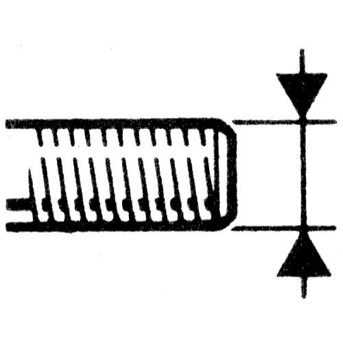
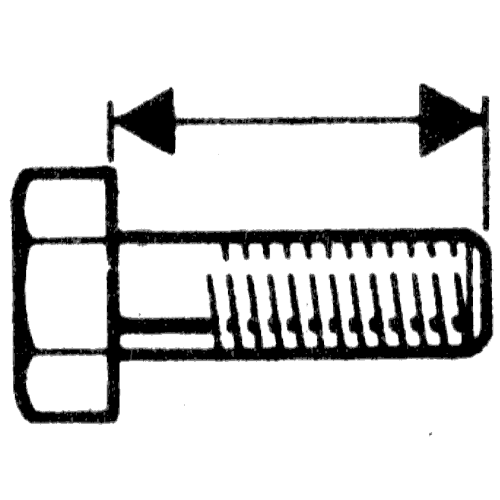
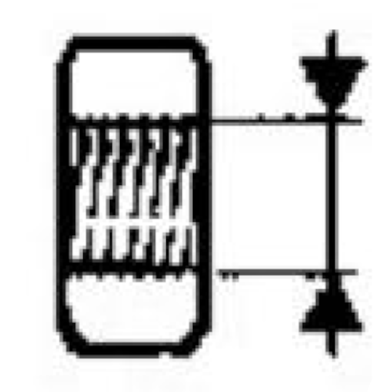
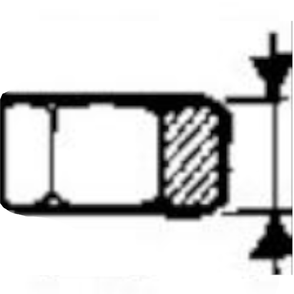
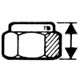
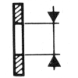
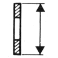
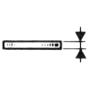

# All spare parts

## From ---- to 1993

### Hex Screw (149)

|  |  |  |  |  |  |  |
| :--: | :--: | :--: | :--: | :--: | :--: | --: |
4 | 70 | 8 | 6-8 | 02 |   | [77 03 001 538](7703001538)
4 | 70 | 10 | 05 | 02 |   | [77 03 001 266](7703001266)
4 | 70 | 12 | 8-8 | 02 |   | [77 03 001 112](7703001112)
4 | 70 | 16 | 6-8 | 02 |   | [77 03 001 650](7703001650)
4 | 70 | 20 | 6-8 | 02 |   | [77 03 001 005](7703001005)
4 | 70 | 20 | 6-8 | 02 | 50 | [77 01 417 227](7701417227)
4 | 70 | 25 | 6-8 | 02 |   | [77 03 001 658](7703001658)
4 | 70 | 30 | 8-8 | 02 |   | [50 03 001 233](5003001233)
5 | 80 | 8 | 6-8 | 02 |   | [77 03 001 007](7703001007)
5 | 80 | 10 | 05 | 02 |   | [77 03 001 855](7703001855)
5 | 80 | 12 | 8-8 | 02 |   | [77 03 001 114](7703001114)
5 | 80 | 16 | 8-8 | 02 |   | [77 03 001 369](7703001369)
5 | 80 | 16 | 8-8 | 02 | 50 | [77 01 417 228](7701417228)
5 | 80 | 20 | 6-8 | 02 |   | [77 03 001 013](7703001013)
5 | 80 | 20 | 6-8 | 02 | 50 | [77 01 405 659](7701405659)
5 | 80 | 25 | 8-8 | 02 |   | [77 03 001 014](7703001014)
5 | 80 | 30 | 8-8 | 02 |   | [77 03 001 425](7703001425)
5 | 80 | 30 | 8-8 | 02 | 20 | [77 01 417 229](7701417229)
5 | 80 | 55 | 8-8 | 02 |   | [50 03 001 710](5003001710)
6 | 100 | 12 | 8-8 | 02 |   | [77 03 001 118](7703001118)
6 | 100 | 16 | 8-8 | 02 |   | [77 03 001 120](7703001120)
6 | 100 | 16 | 8-8 | 02 | 30 | [77 01 405 660](7701405660)
6 | 100 | 16 | 10-9 | 02 |   | [77 03 001 611](7703001611)
6 | 100 | 18 | 10-9 | 02 |   | [77 03 001 742](7703001742)
6 | 100 | 20 | 8-8 | 02 |   | [77 03 001 122](7703001122)
6 | 100 | 20 | 8-8 | 02 | 30 | [77 01 405 661](7701405661)
6 | 100 | 25 | 8-8 | 02 |   | [77 03 001 123](7703001123)
6 | 100 | 25 | 8-8 | 02 | 30 | [77 01 405 662](7701405662)
6 | 100 | 30 | 8-8 | 02 |   | [77 03 001 125](7703001125)
6 | 100 | 30 | 8-8 | 02 | 20 | [77 01 405 663](7701405663)
6 | 100 | 35 | 8-8 | 02 |   | [77 03 001 127](7703001127)
6 | 100 | 40 | 8-8 | 02 |   | [77 03 001 129](7703001129)
6 | 100 | 40 | 8-8 | 02 | 20 | [77 01 417 230](7701417230)
6 | 100 | 45 | 8-8 | 02 |   | [77 03 001 130](7703001130)
6 | 100 | 50 | 8-8 | 02 |   | [77 03 001 132](7703001132)
6 | 100 | 50 | 8-8 | 02 | 10 | [77 01 417 231](7701417231)
6 | 100 | 55 | 8-8 | 02 |   | [77 03 001 134](7703001134)
6 | 100 | 60 | 8-8 | 02 |   | [77 03 001 402](7703001402)
7 | 100 | 12 | 8-8 | 02 |   | [77 03 001 136](7703001136)
7 | 100 | 16 | 8-8 | 02 |   | [77 03 001 138](7703001138)
7 | 100 | 20 | 10-9 | 02 |   | [77 03 001 236](7703001236)
7 | 100 | 25 | 8-8 | 02 |   | [77 03 001 142](7703001142)
7 | 100 | 30 | 10-9 | 02 |   | [77 03 001 614](7703001614)
7 | 100 | 35 | 10-9 | 02 |   | [77 03 001 634](7703001634)
7 | 100 | 40 | 10-9 | 02 |   | [50 03 001 123](5003001123)
7 | 100 | 45 | 10-9 | 02 |   | [77 03 001 607](7703001607)
7 | 100 | 50 | 10-9 | 02 |   | [77 03 001 237](7703001237)
7 | 100 | 55 | 10-9 | 02 |   | [77 03 001 667](7703001667)
7 | 100 | 60 | 8-8 | 02 |   | [77 03 001 153](7703001153)
7 | 100 | 65 | 10-9 | 02 |   | [77 03 001 238](7703001238)
7 | 100 | 70 | 8-8 | 02 |   | [77 03 101 103](7703101103)
7 | 100 | 85 | 10-9 | 02 |   | [77 03 001 443](7703001443)
7 | 100 | 90 | 10-9 | 02 |   | [77 03 001 435](7703001435)
7 | 100 | 95 | 10-9 | 02 |   | [77 03 101 011](7703101011)
8 | 125 | 12 | 10-9 | 02 |   | [77 03 001 800](7703001800)
8 | 125 | 14 | 8-8 | 02 |   | [77 03 001 156](7703001156)
8 | 125 | 16 | 8-8 | 02 |   | [77 03 001 158](7703001158)
8 | 125 | 20 | 8-8 | 02 |   | [77 03 001 160](7703001160)
8 | 125 | 20 | 8-8 | 02 | 20 | [77 01 405 666](7701405666)
8 | 125 | 20 | 10-9 | 02 |   | [77 03 001 820](7703001820)
8 | 125 | 25 | 8-8 | 02 |   | [77 03 001 162](7703001162)
8 | 125 | 25 | 8-8 | 02 | 20 | [77 01 405 667](7701405667)
8 | 125 | 30 | 10-9 | 02 |   | [77 03 001 373](7703001373)
8 | 125 | 35 | 10-9 | 02 |   | [77 03 001 240](7703001240)
8 | 125 | 40 | 10-9 | 02 |   | [77 03 001 693](7703001693)
8 | 125 | 45 | 10-9 | 02 |   | [77 03 001 608](7703001608)
8 | 125 | 50 | 10-9 | 02 |   | [77 03 001 552](7703001552)
8 | 125 | 55 | 8-8 | 02 |   | [77 03 001 169](7703001169)
8 | 125 | 60 | 8-8 | 02 |   | [77 03 001 170](7703001170)
8 | 125 | 60 | 8-8 | 02 | 5 | [77 01 417 233](7701417233)
8 | 125 | 65 | 8-8 | 02 |   | [77 03 001 729](7703001729)
8 | 125 | 70 | 10-9 | 02 |   | [77 03 001 822](7703001822)
8 | 125 | 75 | 8-8 | 02 |   | [77 03 001 397](7703001397)
8 | 125 | 80 | 10-9 | 02 |   | [77 03 001 241](7703001241)
8 | 125 | 90 | 8-8 | 02 |   | [77 03 001 481](7703001481)
8 | 125 | 97 | 10-9 | 02 |   | [77 03 001 806](7703001806)
8 | 125 | 100 | 8-8 | 02 |   | [77 03 001 178](7703001178)
8 | 125 | 130 | 10-9 | 02 |   | [77 03 001 891](7703001891)
8 | 125 | 135 | 8-8 | 02 |   | [77 03 101 216](7703101216)
10 | 125 | 14 | 8-8 | 02 |   | [77 03 101 171](7703101171)
10 | 125 | 20 | 8-8 | 02 |   | [77 03 101 133](7703101133)
10 | 125 | 25 | 8-8 | 02 |   | [77 03 101 134](7703101134)
10 | 125 | 30 | 10-9 | 02 |   | [50 03 101 460](5003101460)
10 | 125 | 35 | 10-9 | 02 |   | [77 03 101 166](7703101166)
10 | 125 | 55 | 8-8 | 02 |   | [77 03 101 135](7703101135)
10 | 125 | 70 | 8-8 | 02 |   | [77 03 101 119](7703101119)
10 | 125 | 75 | 8-8 | 02 |   | [77 03 101 120](7703101120)
10 | 125 | 85 | 8-8 | 02 |   | [77 03 101 121](7703101121)
10 | 125 | 110 | 10-9 | 02 |   | [77 03 101 090](7703101090)
10 | 125 | 130 | 10-9 | 02 |   | [77 03 101 199](7703101199)
10 | 150 | 16 | 8-8 | 02 |   | [77 03 101 140](7703101140)
10 | 150 | 20 | 8-8 | 02 |   | [77 03 101 044](7703101044)
10 | 150 | 25 | 8-8 | 02 |   | [77 03 101 045](7703101045)
10 | 150 | 25 | 8-8 | 02 | 10 | [77 01 405 670](7701405670)
10 | 150 | 30 | 10-9 | 02 |   | [77 03 101 069](7703101069)
10 | 150 | 35 | 10-9 | 02 |   | [77 03 101 070](7703101070)
10 | 150 | 40 | 10-9 | 02 |   | [77 03 101 072](7703101072)
10 | 150 | 45 | 10-9 | 02 |   | [77 03 101 073](7703101073)
10 | 150 | 50 | 10-9 | 02 |   | [77 03 101 074](7703101074)
10 | 150 | 55 | 10-9 | 02 |   | [77 03 101 075](7703101075)
10 | 150 | 60 | 8-8 | 02 |   | [77 03 101 076](7703101076)
10 | 150 | 60 | 8-8 | 02 | 5 | [77 01 417 235](7701417235)
10 | 150 | 65 | 10-9 | 02 |   | [77 03 101 053](7703101053)
10 | 150 | 70 | 8-8 | 02 |   | [77 03 101 054](7703101054)
10 | 150 | 75 | 10-9 | 02 |   | [77 03 101 175](7703101175)
10 | 150 | 80 | 10-9 | 02 |   | [77 03 101 079](7703101079)
10 | 150 | 85 | 8-8 | 02 |   | [77 03 101 056](7703101056)
10 | 150 | 90 | 8-8 | 02 |   | [77 03 101 057](7703101057)
10 | 150 | 105 | 10-9 | 02 |   | [77 03 101 114](7703101114)
10 | 150 | 110 | 8-8 | 02 |   | [77 03 101 059](7703101059)
10 | 150 | 120 | 10-9 | 02 |   | [77 03 101 084](7703101084)
10 | 150 | 130 | 10-9 | 02 |   | [77 03 101 094](7703101094)
10 | 150 | 140 | 8-8 | 02 |   | [77 03 101 060](7703101060)
10 | 150 | 166 | 10-9 | 02 |   | [77 03 101 109](7703101109)
12 | 125 | 15 | 8-8 | 02 |   | [77 00 713 613](7700713613)
12 | 125 | 22 | 10-9 | 02 |   | [77 00 783 365](7700783365)
12 | 125 | 30 | 8-8 | 02 |   | [77 03 101 247](7703101247)
12 | 125 | 35 | 10-9 | 02 |   | [77 03 101 091](7703101091)
12 | 125 | 40 | 10-9 | 02 |   | [77 03 001 755](7703001755)
12 | 125 | 50 | 10-9 | 02 |   | [77 03 101 093](7703101093)
12 | 125 | 55 | 8-8 | 02 |   | [77 03 101 136](7703101136)
12 | 125 | 60 | 10-9 | 02 |   | [77 03 101 097](7703101097)
12 | 125 | 70 | 10-9 | 02 |   | [50 03 101 155](5003101155)
12 | 125 | 82 | 10-9 | 02 |   | [77 03 101 173](7703101173)
12 | 125 | 170 | 10-9 | 02 |   | [77 03 101 168](7703101168)
12 | 150 | 35 | 10-9 | 02 |   | [79 03 001 174](7903001174)
12 | 150 | 40 | 10-9 | 02 |   | [50 03 101 182](5003101182)
12 | 150 | 80 | 10-9 | 02 |   | [50 03 101 183](5003101183)
12 | 175 | 20 | 6-8 | 02 |   | [77 03 101 139](7703101139)
12 | 175 | 25 | 8-8 | 02 |   | [77 03 101 061](7703101061)
12 | 175 | 30 | 8-8 | 02 |   | [50 03 101 123](5003101123)
12 | 175 | 35 | 8-8 | 02 |   | [77 03 101 062](7703101062)
12 | 175 | 40 | 8-8 | 02 |   | [77 03 101 063](7703101063)
12 | 175 | 45 | 10-9 | 02 |   | [77 03 101 147](7703101147)
12 | 175 | 50 | 8-8 | 02 |   | [77 03 101 211](7703101211)
12 | 175 | 55 | 8-8 | 02 |   | [50 03 101 126](5003101126)
12 | 175 | 60 | 8-8 | 02 |   | [77 03 101 064](7703101064)
12 | 175 | 100 | 8-8 | 02 |   | [77 03 101 236](7703101236)
12 | 175 | 77 | 10-9 | 02 |   | [77 00 756 576](7700756576)
12 | 175 | 90 | 10-9 | 02 |   | [50 03 101 317](5003101317)
12 | 175 | 110.5 | 10-9 | 02 |   | [77 00 756 575](7700756575)
14 | 150 | 45 | 10-9 | 02 |   | [77 03 101 095](7703101095)
14 | 150 | 70 | 8-8 | 02 |   | [77 03 101 123](7703101123)
14 | 150 | 160 | 8-8 | 02 |   | [77 03 101 124](7703101124)
14 | 200 | 32 | 10-9 | 02 |   | [77 03 101 145](7703101145)
14 | 200 | 60 | 8-8 | 02 |   | [77 03 101 100](7703101100)
14 | 200 | 90 | 8-8 | 02 |   | [50 03 101 178](5003101178)
14 | 200 | 110 | 8-8 | 02 |   | [77 03 101 067](7703101067)
14 | 200 | 190 | 8-8 | 02 |   | [50 03 001 858](5003001858)

### Hex nut (31)

|  |  |  |  |  |  |  |
| :--: | :--: | :--: | :--: | :--: | :--: | --: |
3 | 50 | 2.4 | 8-8 | 02 |   | [77 03 032 107](7703032107)
4 | 70 | 3.2 | 8-8 | 02 |   | [79 03 032 003](7903032003)
4 | 70 | 3.2 | 8-8 | 02 | 100 | [77 01 417 218](7701417218)
5 | 80 | 4 | 8-8 | 02 |   | [79 03 032 006](7903032006)
5 | 80 | 4 | 8-8 | 02 | 50 | [77 01 405 672](7701405672)
6 | 100 | 5 | 8-8 | 02 |   | [77 03 032 131](7703032131)
6 | 100 | 5 | 8-8 | 02 | 50 | [77 01 405 673](7701405673)
7 | 100 | 5.5 | 8-8 | 02 |   | [79 03 032 012](7903032012)
7 | 100 | 5.5 | 8-8 | 02 | 30 | [77 01 405 674](7701405674)
8 | 100 | 6.8 | 8-8 | 02 |   | [77 03 032 063](7703032063)
8 | 125 | 6.5 | 8-8 | 02 |   | [79 03 032 018](7903032018)
8 | 125 | 6.5 | 8-8 | 02 | 50 | [77 01 405 675](7701405675)
8 | 125 | 6.8 | 8-8 | 02 |   | [77 03 032 048](7703032048)
8 | 125G | 4 | 4-8 | 02 |   | [77 03 032 121](7703032121)
10 | 125 | 8.4 | 10-9 | 02 |   | [50 03 032 156](5003032156)
10 | 150 | 4 | 4-8 | 02 |   | [77 03 032 105](7703032105)
10 | 150 | 8.4 | 10-9 | 02 |   | [77 03 032 103](7703032103)
10 | 150 | 8.4 | 8-8 | 02 | 30 | [77 01 405 676](7701405676)
12 | 125 | 10.8 | 10-9 | 02 |   | [50 03 032 157](5003032157)
12 | 150 | 10.8 | 10-9 | 02 |   | [50 03 032 197](5003032197)
12 | 175 | 10.8 | 8-8 | 02 |   | [77 03 032 102](7703032102)
14 | 150 | 7 | 8-8 | 02 |   | [50 03 032 165](5003032165)
14 | 200 | 11 | 10-9 | 02 |   | [77 03 032 104](7703032104)
16 | 100 | 6 | 4-8 | 04 |   | [77 03 032 068](7703032068)
16 | 100 | 8 | 4-8 | 02 |   | [77 03 032 083](7703032083)
16 | 150 | 8 | 4-8 | 02 |   | [77 03 032 056](7703032056)
16 | 200 | 13 | 10-9 | 02 |   | [77 03 032 009](7703032009)
20 | 150 | 10 | 4-8 | 02 |   | [50 03 032 103](5003032103)
20 | 150 | 18 | 10-9 | 02 |   | [50 03 032 113](5003032113)
24 | 150 | 10 | 8-8 | 02 |   | [50 03 032 085](5003032085)
24 | 150G | 10 | 10-9 | 02 |   | [77 03 032 099](7703032099)

### Hex lock nut (28)

|  |  |  |  |  |  |  |
| :--: | :--: | :--: | :--: | :--: | :--: | --: |
4 | 70 | 6 | 8-8 | 02 |   | [77 03 034 006](7703034006)
5 | 80 | 5.4 | 8-8 | 02 |   | [77 03 034 007](7703034007)
6 | 100 | 8 | 8-8 | 02 |   | [77 03 034 008](7703034008)
6 | 100 | 8 | 8-8 | 02 | 30 | [77 01 417 219](7701417219)
6 | 100G | 6 | 8-8 | 02 |   | [77 03 034 066](7703034066)
7 | 100 | 8.5 | 10-9 | 02 |   | [77 03 034 016](7703034016)
7 | 100 | 8.5 | 8-8 | 02 | 20 | [77 01 417 220](7701417220)
8 | 100 | 8.8 | 8-8 | 02 |   | [77 03 034 026](7703034026)
8 | 125 | 8.5 | 10-9 | 02 |   | [77 03 034 037](7703034037)
8 | 125 | 10.6 | 8-8 | 02 | 30 | [77 01 417 221](7701417221)
9 | 125 | 9.1 | 10-9 | 02 |   | [77 03 034 060](7703034060)
10 | 125 | 12.6 | 10-9 | 02 |   | [77 03 034 098](7703034098)
10 | 125 | 12.6 | 8-8 | 02 | 10 | [77 01 422 002](7701422002)
10 | 150 | 11.1 | 8-8 | 02 |   | [77 03 034 106](7703034106)
10 | 150 | 12.4 | 8-8 | 02 | 10 | [77 01 417 222](7701417222)
12 | 125 | 14 | 10-9 | 02 |   | [77 03 034 100](7703034100)
12 | 125 | 14 | 8-8 | 02 | 5 | [77 01 422 003](7701422003)
12 | 150 | 14 | 8-8 | 02 |   | [77 03 034 049](7703034049)
12 | 175 | 14 | 10-9 | 02 |   | [77 03 034 110](7703034110)
12 | 175 | 14 | 8-8 | 02 | 10 | [77 01 422 004](7701422004)
12 | 175 | 18 | 10-9 | 02 |   | [77 03 034 115](7703034115)
14 | 150 | 13.1 | 8-8 | 02 |   | [77 03 034 096](7703034096)
14 | 200 | 16.6 | 10-9 | 02 |   | [77 03 034 101](7703034101)
16 | 150 | 14 | 10-9 | 02 |   | [77 03 034 040](7703034040)
16 | 200 | 13.2 | 8-8 | 02 |   | [77 03 034 033](7703034033)
16 | 200 | 16.2 | 10-9 | 02 |   | [77 03 034 062](7703034062)
18 | 150 | 15.5 | 8-8 | 02 |   | [77 03 034 125](7703034125)
20 | 150 | 16.6 | 10-9 | 02 |   | [77 03 034 068](7703034068)

### Hex collar nut (10)

|  |  |  | Dc |  |  |  |
| :--: | :--: | :--: | :--: | :--: | :--: | --: |
4 | 70 | 4.7 | 9.6 | 8-8 |   | [77 03 033 006](7703033006)
5 | 80 | 5 | 11.8 | 8-8 |   | [77 03 033 043](7703033043)
5 | 80 | 5 | 11.8 | 8-8 | 30 | [77 01 422 009](7701422009)
6 | 100 | 6 | 14.2 | 8-8 |   | [77 03 033 027](7703033027)
7 | 100 | 6 | 14 | 10-9 |   | [77 03 033 055](7703033055)
7 | 100 | 6 | 14 | 10-9 | 20 | [77 01 422 011](7701422011)
8 | 125 | 8 | 17.9 | 8-8 |   | [77 03 033 025](7703033025)
8 | 125 | 8 | 17.9 | 8-8 | 30 | [77 01 422 012](7701422012)
10 | 150 | 10 | 21.8 | 8-8 |   | [77 03 033 033](7703033033)
10 | 150 | 10 | 21.8 | 8-8 | 10 | [77 01 422 013](7701422013)

### Washer (48)

|  |   |  |  |   |  |
| :--: | :--: | :--: | :--: | :--: | --: |
3 | 6 | 0.8 | 4-8 |   | [77 03 053 653](7703053653)
4 | 8 | 0.8 | 4-8 |   | [77 03 053 654](7703053654)
4 | 14 | 0.8 | 4-8 |   | [77 03 053 663](7703053663)
5 | 10 | 1 | 6-8 |   | [77 03 053 655](7703053655)
5 | 10 | 1 | 6-8 | 100 | [77 01 402 057](7701402057)
5 | 16 | 1 | 05 |   | [77 03 053 172](7703053172)
5 | 16 | 1 | 05 | 100 | [77 01 402 059](7701402059)
6 | 11 | 1.2 | 4-8 |   | [77 03 053 030](7703053030)
6 | 11 | 1.2 | 4-8 | 100 | [77 01 402 061](7701402061)
6 | 14 | 2 | 4-8 |   | [77 03 053 032](7703053032)
6 | 18 | 1.2 | 4-8 |   | [77 03 053 434](7703053434)
6 | 18 | 1.2 | 4-8 | 100 | [77 01 402 062](7701402062)
6 | 20 | 4 | 4-8 |   | [77 03 053 401](7703053401)
7 | 10 | 1 | 4-8 |   | [77 03 053 642](7703053642)
7 | 14 | 1.5 | 2 |   | [77 03 053 666](7703053666)
7 | 16 | 2 | 4-8 |   | [77 03 053 036](7703053036)
7 | 20 | 2.5 | 4-8 |   | [77 03 053 658](7703053658)
8 | 14 | 5 | 4-8 |   | [77 03 053 441](7703053441)
10 | 23 | 3 | 4-8 |   | [77 03 053 043](7703053043)
8 | 16 | 1.5 | 4-8 | 100 | [77 01 402 068](7701402068)
8 | 16 | 3 | 4-8 |   | [77 03 053 127](7703053127)
8 | 18 | 2.5 | 4-8 |   | [77 03 053 037](7703053037)
8 | 20 | 3.5 | 4-8 |   | [77 03 053 334](7703053334)
8 | 22 | 1 | 4-8 |   | [77 03 053 298](7703053298)
8 | 22 | 1.5 | 4-8 |   | [79 03 053 045](7903053045)
8 | 21 | 6 | 6-8 |   | [77 03 053 067](7703053067)
8 | 30 | 1.5 | 6-8 |   | [77 03 053 635](7703053635)
8 | 30 | 1.5 | 6-8 | 20 | [77 01 402 070](7701402070)
8 | 30 | 2 | 4-8 |   | [77 03 053 661](7703053661)
10 | 14 | 3 | 4-8 |   | [77 03 053 366](7703053366)
10 | 20 | 2 | 4-8 |   | [77 03 053 075](7703053075)
10 | 20 | 2 | 4-8 | 50 | [77 01 402 071](7701402071)
10 | 20 | 4 | 4-8 |   | [77 03 053 389](7703053389)
10 | 27 | 2 | 4-8 |   | [77 03 053 138](7703053138)
10 | 34 | 3 | 4-8 |   | [77 03 053 346](7703053346)
10 | 35 | 5 | 4-8 |   | [77 03 053 189](7703053189)
12 | 22 | 4 | 4-8 |   | [77 03 053 114](7703053114)
12 | 24 | 2.5 | 4-8 |   | [77 03 053 662](7703053662)
12 | 24 | 2.5 | 4-8 | 20 | [77 01 402 073](7701402073)
12 | 32 | 2.5 | 4-8 |   | [77 03 053 478](7703053478)
12 | 34 | 5 | 10-9 |   | [77 03 053 345](7703053345)
12 | 40 | 5 | 8-8 |   | [77 03 053 348](7703053348)
14 | 27 | 2.5 | 4-8 |   | [77 03 053 452](7703053452)
14 | 27 | 4 | 4-8 |   | [77 03 053 015](7703053015)
16 | 26 | 2 | 4-8 |   | [77 03 053 423](7703053423)
16 | 30 | 4 | 4-8 |   | [77 03 053 373](7703053373)
18 | 40 | 3 | 6-8 |   | [77 03 053 524](7703053524)
20 | 35 | 4.5 | 6-8 |   | [77 03 053 640](7703053640)

### Spring washer (14)

|  |  |   |  |
| :--: | :--: | :--: | --: |
4 | 7.1 |   | [50 03 055 001](5003055001)
4 | 7.1 | 100 | [77 01 417 206](7701417206)
5 | 8.8 |   | [77 03 055 005](7703055005)
5 | 8.8 | 100 | [77 01 417 236](7701417236)
6 | 9.9 |   | [77 03 055 007](7703055007)
6 | 9.9 | 100 | [77 01 402 091](7701402091)
7 | 12.9 |   | [77 03 055 031](7703055031)
7 | 12.9 | 100 | [77 01 402 092](7701402092)
8 | 12.9 |   | [77 03 055 011](7703055011)
8 | 12.9 | 50 | [77 01 402 093](7701402093)
10 | 16 |   | [77 03 055 013](7703055013)
10 | 16 | 20 | [77 01 402 094](7701402094)
12 | 18 |   | [77 03 055 015](7703055015)
14 | 21 |   | [50 03 055 003](5003055003)

### Fan washer (22)

|  |   |  |  |  |   |  |
| :--: | :--: | :--: | :--: | :--: | :--: | --: |
3 | 6 | **X** |   |   |   | [79 03 056 001](7903056001)
4 | 8.2 | **X** |   |   |   | [77 03 056 106](7703056106)
5 | 9.4 | **X** |   |   |   | [79 03 056 005](7903056005)
5 | 9.4 | **X** |   |   | 100 | [77 01 402 081](7701402081)
5 | 12.2 |   | **X** |   |   | [77 03 056 058](7703056058)
6 | 11.3 | **X** |   |   |   | [79 03 056 008](7903056008)
6 | 11.3 | **X** |   |   | 100 | [77 01 402 082](7701402082)
6 | 12.2 |   |   | **X** |   | [77 03 056 097](7703056097)
6 | 18.3 |   | **X** |   |   | [77 03 056 083](7703056083)
7 | 12.3 | **X** |   |   |   | [77 03 056 078](7703056078)
7 | 12.3 | **X** |   |   | 100 | [77 01 402 083](7701402083)
7 | 18.3 |   | **X** |   |   | [77 03 056 084](7703056084)
8 | 14.3 | **X** |   |   |   | [79 03 056 014](7903056014)
8 | 14.3 | **X** |   |   | 100 | [77 01 402 084](7701402084)
8 | 16 |   |   | **X** |   | [79 03 056 059](7903056059)
8 | 22.3 |   | **X** |   |   | [77 03 056 085](7703056085)
8 | 22.3 |   | **X** |   | 20 | [77 01 402 079](7701402079)
10 | 26.3 |   | **X** |   |   | [77 03 056 086](7703056086)
12 | 21.7 | **X** |   |   |   | [77 03 056 079](7703056079)
12 | 32.4 |   | **X** |   |   | [77 03 056 087](7703056087)
14 | 24 | **X** |   |   |   | [77 03 056 081](7703056081)
16 | 26.4 | **X** |   |   |   | [79 03 056 024](7903056024)

### Stud (44)

|  |   |  |  |  |  |  |  |
| :--: | :--: | :--: | :--: | :--: | :--: | :--: | --: |
5 | 80 | 55 | 45 | 10 | 16 | 8-8 | [77 03 027 140](7703027140)
5 | 80 | 65 | 55 | 10 | 20 | 6-8 | [77 03 027 158](7703027158)
5 | 80 | 70 | 60 | 10 | 20 | 6-8 | [77 03 027 128](7703027128)
5 | 80 | 85 | 75 | 10 | 20 | 6-8 | [77 03 027 127](7703027127)
6 | 100 | 28 | 16 | 12 | 12 | 8-8 | [77 03 027 092](7703027092)
6 | 100 | 44 | 35 | 9 | 18 | 8-8 | [77 03 027 215](7703027215)
7 | 100 | 20.5 | 10 | 10.5 | 8 | 6-8 | [77 03 027 072](7703027072)
7 | 100 | 26.5 | 16 | 10.5 | 10.5 | 6-8 | [77 03 027 046](7703027046)
7 | 100 | 35.5 | 25 | 10.5 | 17 | 6-8 | [77 03 027 099](7703027099)
7 | 100 | 50 | 36 | 14 | 13 | 8-8 | [77 03 027 095](7703027095)
7 | 100 | 69 | 55 | 14 | 20 | 8-8 | [77 03 027 113](7703027113)
7 | 100 | 95.5 | 85 | 10.5 | 20 | 6-8 | [77 03 027 088](7703027088)
7 | 100 | 102 | 88 | 14 | 50 | 8-8 | [77 03 027 114](7703027114)
8 | 125 | 24 | 13 | 11 | 11 | 8-8 | [77 03 027 048](7703027048)
8 | 125 | 28 | 16 | 12 | 12 | 10-9 | [77 03 027 081](7703027081)
8 | 125 | 36 | 20 | 16 | 16 | 10-9 | [77 03 027 094](7703027094)
8 | 125 | 37 | 25 | 12 | 18 | 10-9 | [77 03 027 082](7703027082)
8 | 125 | 37 | 25 | 12 | 22 | 6-8 | [77 03 027 207](7703027207)
8 | 125 | 40 | 30 | 10 | 22 | 6-8 | [77 03 027 045](7703027045)
8 | 125 | 41 | 25 | 16 | 18 | 10-9 | [77 03 027 025](7703027025)
8 | 125 | 42 | 30 | 12 | 22 | 10-9 | [77 03 027 191](7703027191)
8 | 125 | 46 | 30 | 16 | 16 | 10-9 | [77 03 027 172](7703027172)
8 | 125 | 46 | 30 | 16 | 22 | 10-9 | [77 03 027 076](7703027076)
8 | 125 | 47 | 25 | 22 | 22 | 6-8 | [77 03 027 102](7703027102)
8 | 125 | 47 | 35 | 12 | 22 | 8-8 | [77 03 027 007](7703027007)
8 | 125 | 51 | 35 | 16 | 22 | 10-9 | [77 03 027 129](7703027129)
8 | 125 | 52 | 40 | 12 | 28 | 8-8 | [77 03 027 125](7703027125)
8 | 125 | 57 | 45 | 12 | 22 | 8-8 | [77 03 027 079](7703027079)
8 | 125 | 61 | 42 | 19 | 29 | 10-9 | [77 03 027 211](7703027211)
8 | 125 | 62 | 50 | 12 | 22 | 8-8 | [77 03 027 085](7703027085)
8 | 125 | 71 | 55 | 16 | 22 | 8-8 | [77 03 027 077](7703027077)
8 | 125 | 81 | 65 | 16 | 22 | 8-8 | [77 03 027 086](7703027086)
8 | 125 | 86 | 73.5 | 13.5 | 25 | 8-8 | [77 03 027 168](7703027168)
10 | 125 | 40 | 25 | 15 | 20 | 8-8 | [77 03 027 223](7703027223)
10 | 150 | 36 | 18 | 18 | 12 | 8-8 | [77 03 027 111](7703027111)
10 | 150 | 45 | 30 | 15 | 22 | 10-9 | [77 03 027 142](7703027142)
10 | 150 | 60 | 40 | 20 | 26 | 6-8 | [77 03 027 037](7703027037)
10 | 150 | 60 | 45 | 15 | 26 | 10-9 | [77 03 027 159](7703027159)
10 | 150 | 65 | 50 | 15 | 26 | 8-8 | [77 03 027 012](7703027012)
10 | 150 | 70 | 55 | 15 | 26 | 8-8 | [77 03 027 090](7703027090)
10 | 150 | 80 | 65 | 15 | 26 | 10-9 | [77 03 027 070](7703027070)
10 | 150 | 90 | 75 | 15 | 26 | 8-8 | [77 03 027 091](7703027091)
10 | 150 | 95 | 75 | 20 | 30 | 10-9 | [77 03 027 195](7703027195)
10 | 150 | 115 | 100 | 15 | 40 | 10-9 | [77 03 027 187](7703027187)

