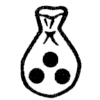

# __catalog_page_title



## {{ part_category[LC]["hex_screw"] }} ({{ parts_hex_screws.keys() | length }})

|  |  |  |  |  |  |  |
| :--: | :--: | :--: | :--: | :--: | :--: | --: |


{{ desc.nominal_diameter }} | {{ desc.pitch }} | {{ desc.length }} | {{desc.material}} | {{desc.protection}} | {{ desc.quantity if desc.quantity != '1' else ' ' }} | [{{ code }}]({{ item }}) 


## {{ part_category[LC]["hex_bolts"] }} ({{ parts_hex_bolts.keys() | length }})

|  |  |  |  |  |  |  |
| :--: | :--: | :--: | :--: | :--: | :--: | --: |


{{ desc.diameter }} | {{ desc.pitch }} | {{ desc.height }} | {{desc.material}} | {{desc.protection}} | {{ desc.quantity if desc.quantity != '1' else ' ' }} | [{{ code }}]({{ item }}) 
